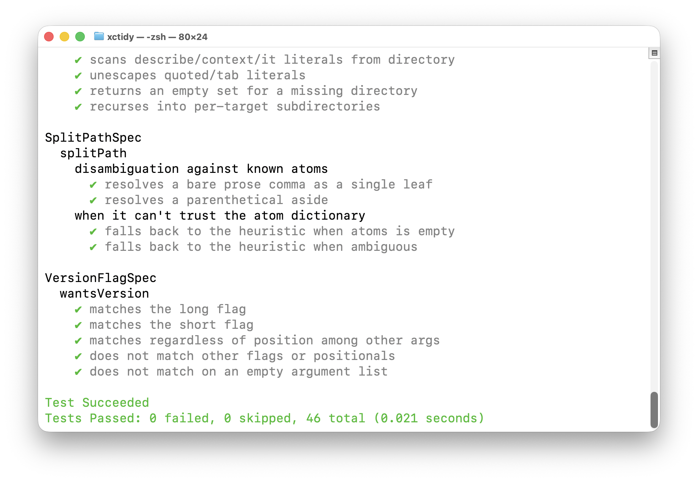

# xctidy

[](Package.swift)
[](https://github.com/woodie/xctidy/actions/workflows/makefile.yml)
[](https://github.com/woodie/xctidy/releases/latest)
[](LICENSE)



RSpec/Mocha/Vitest-style output for Swift that works with `xcodebuild
test`/`swift test` by parsing their raw output directly. A drop-in
alternative to xcbeautify and xcpretty, including as fastlane's
`xcodebuild_formatter`. Skim a thousand-line Xcode test log in seconds
instead of scrolling past it.

## Installation

### Build from source

```bash
git clone https://github.com/woodie/xctidy.git
cd xctidy
make install
```

## Usage

```bash
xcodebuild test [flags] | xctidy Tests
```

On CI, also propagate the upstream exit status, since a build failure
before any test runs never reaches `xctidy` to reflect in its own:

```bash
set -o pipefail && xcodebuild test [flags] | xctidy Tests
```

For `swift test`, redirect stderr -- XCTest's status lines land there, not
stdout:

```bash
swift test 2>&1 | xctidy Tests
```

The positional argument (`Tests` above) is your specs directory, used to
disambiguate comma-flattened `describe`/`context`/`it` names. Omit it and
`xctidy` falls back to a heuristic.

### fastlane

`scan` (and `gym`/`snapshot`) already hand this exact pipeline slot to
xcbeautify/xcpretty via the `xcodebuild_formatter` option -- swap the value,
no new stage needed:

```ruby
# Fastfile
lane :test do
  scan(
    scheme: "MyApp",
    xcodebuild_formatter: "/usr/local/bin/xctidy -fd Tests"
  )
end
```

### Version

```bash
xctidy --version
```

Prints the installed version and exits -- bare number, no `xctidy`/`v`
prefix (matches xcbeautify's `--version` style). Derived from the nearest
git tag at build time (see the Makefile's `version` target), so it always
reflects what you actually installed, not a hand-maintained constant.

## Output styles

Four named styles, each matching a convention from a familiar test runner.
The first three end with the same xcbeautify-style footer; `-fv` ends with
Vitest's own footer shape instead.

| Flag | Convention | Look |
|---|---|---|
|   | Our base formatter | Glyph + `name (N seconds)`, failures add `(FAILED - N)` |
| -fd | RSpec's doc format | Plain colored name, yellow `(PENDING)` for skips |
| -fs | Mocha's spec format | Green `✔` + gray name, red `✗ name (FAILED - N)` |
| -fv | Vitest's own tree | Green `✓ name`, two-toned green `2ms`, red `× name`, dim gray `↓ name` |

`-fv` currently omits Vitest's `Test Files` line: XCTest's own Test Suite
nesting (a per-class suite wrapped in an "All tests"/"Selected tests"
aggregate suite) hasn't been verified against real `xcodebuild` output, so
a suite-level pass/fail count risks over-counting the wrapper suites as if
they were their own files.

The screenshot above is `-fs`. Full samples of all three xcbeautify-style
styles: [docs/HOW_IT_WORKS.md](docs/HOW_IT_WORKS.md#output-styles).

## Things to know

### Writing tests

`xctidy` renders whatever nesting your test framework produces, so the
nesting it shows is only as good as how you write your specs. If you're
using [Quick](https://github.com/Quick/Quick)/[Nimble](https://github.com/Quick/Nimble)
(the `describe`/`context`/`it` style), keep to **one `QuickSpec` class per
file, one top-level `describe` per file, matching the file's subject** --
see [`Tests/XctidyKitTests/SplitPathSpec.swift`](Tests/XctidyKitTests/SplitPathSpec.swift)
for a minimal example. It keeps the rendered tree predictable (one root
per file) and keeps `-only-testing:` selection a one-line lookup instead
of a multi-file hunt (see `docs/DEVELOPMENT.md`'s
[Test](docs/DEVELOPMENT.md#test) section for why `swift test --filter`
doesn't work with Quick and what to use instead).

For how we structure what's *inside* a spec -- nesting context so it's
available to sub-tests, mocking and stubbing -- see
[docs/FRAMEWORK.md](docs/FRAMEWORK.md).

### Limitations

`xctidy`'s own exit code only reflects test cases it actually rendered --
a build failure before any test runs never reaches it, so `set -o
pipefail` is what carries that upstream failure through on CI (see
Usage above). See
[docs/HOW_IT_WORKS.md](docs/HOW_IT_WORKS.md#known-limitations) for how
the comma disambiguation and failure folding actually work, and for known
limitations (no Linux support, no JUnit/CI-UI renderers, Quick/Nimble-only
scope).

## Development

```
make build    # swift build --configuration release
make install  # builds, then copies the binary to $(PREFIX)/bin (default /usr/local)
make test     # verbose, dogfoods xctidy on its own suite in -fs style (swift test | xctidy -fs)
make lint     # swiftlint lint --strict
make check    # terse: silent on success, full log on failure
```

See [docs/DEVELOPMENT.md](docs/DEVELOPMENT.md) for project layout, how to
add a render style, the release process, and the rest of the Makefile
(`uninstall`, `clean`, `xcode`).
